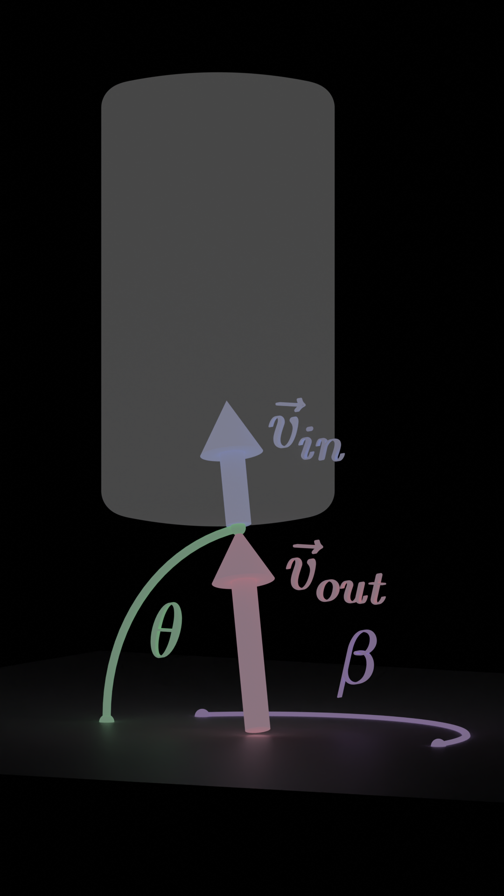
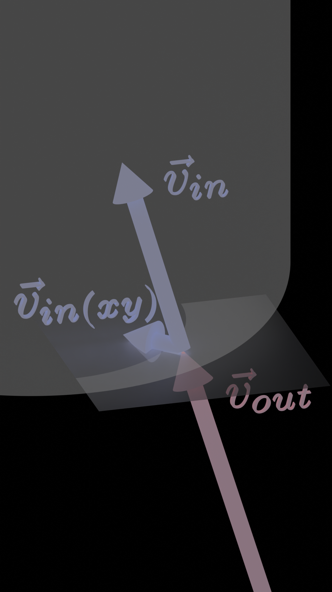

# Quartz Resonance Simulation in Blender

## Overview
This is a bullshit pseudoscientific "magic quartz crystal" acoustics simulation, designed to calculate the optimal height to cut a specific quartz shape allowing for maximum resonance. The real-world intent is to resonate a small piece of this quartz with hypersonic longitudinal in a ripple-tank-like fashion and produce a precise piezoelectric frequency.

## Scripts Included
- **"Centroid Alignment"**: Uses a centroid gap minimization algorithm to compute the optimal height for quartz resonance.
- **"Generate Quartz"**: Given desired dimensions, creates a beveled para-cyldinrical quartz mesh object using Blender bmesh. 
- **"Animate Waves"**: Generates waves and keyframes the wave animations.

## How to Run the Scripts in Blender
1. Ensure you're within the "Scripting" workspace.
2. At the top of the scripting panel, you'll notice "Centroid Alignment" as the active text file.
3. To the left of this name, there's a dropdown menu where you can select and switch between the provided scripts.
4. Adjust the input parameters to your desires. The comments next to the variables located within the python main function should well describe their purpose (e.g. certain dimensions, amounts, velocities, orientations, etc.)
5. Click the "run script" play button. Beforehand, I usually click on the main "Scene Collection" to make it the active collection such that, for example, a generated collection or mesh object spawns in the scene collection.

## Explainations Begin

(1)

The parabola $y = -\frac{x^2}{2h} + \frac{h}{2}$ plays a role in the shape of the quartz and posesses significant reflection abilities:
- The [**focus**](https://www.varsitytutors.com/hotmath/hotmath_help/topics/focus-of-a-parabola#:~:text=A%20parabola%20is%20set%20of,of%20symmetry%20of%20the%20parabola.) of this parabola is **always** the origin, $(0, 0)$, regardless of the real number, height $h$, where $h$ is twice the distance from the origin to the $x = 0$ point of the parabola ($h$ is the height of the quartz - you'll see why soon). The above visual shows rays emanating radially away from the origin, reflecting with direction vectors precisely equal to $[0, -1]$
- Angle of incidence equals angle of reflection. Hence, when a horizontal line is projected at the parabola vertically from below, every point of line reflects to the origin.

Here's proof of these reflections: https://www.overleaf.com/read/nhgdyvwfctvz

(2)

Likewise, the reflection vectors equal $[0, 1]$ upon the same points casted towards the symmetrical lower parabola, $y = \frac{x^2}{2h} - \frac{h}{2}$. Thus, if a wave is enclosed by the upper and lower parabolas, the wave will oscillate between radial and vertical trajectory.

(3)

If instead spherical waves are bouned by these dual symmetric paraboloids, this concept extends from $\mathbb{R}^2$ to $\mathbb{R}^3$. 

## Longitudinal Oscillator Shape

(4)

(5)

Above lies the shape of the "magic quartz crystal". The quartz's upper and lower portions are sculpted in alignment with the upper and lower paraboloids, while its form is circumscribed to a narrow cylindrical radius. Circular beveling is used to smoothly connect the paraboloids to the cylinder's lateral surfaces.

(6)

A conic projection of angle $\theta$ above the $-z$ axis will intersect the paraboilds at radius $h*tan$dfrac{\theta})$. In perfect conditions, the maximum parabolic radius of the quartz should be set to the maximum trajection angle, which for me is $24.55^circ$. However, in the real world, a bit of grace-room is added to ensure the waves are fully absorbed by the paraboloids. Thus, the blending actually starts at the half angle ($27.25^circ$) between the trajection angle ($24.55^circ$) and the angle which hits the side edges of the quartz ($29.95^circ$).

## A Homogeneous Resonance Longitudinal Oscillator

(7)

For a comprehensive understanding of this simulation, one should initially start with a conic intersection of dual symmetrical paraboloids, made of no tangible material, yet endowed with reflective and transmissive properties. Envision conic segments of spherical sound waves frequently directed towards this configuration, subsequently giving rise to equidistant displacements amongst the waves within the paraboloids.

(8)

Scaling the height $h$ of the paraboloid configuration allows the waves to line up. When firing waves, if the first wave is ahead of the second, scale larger, otherwise if it's behind, scale smaller. These waves travel at a constant velocity in the $z$-direction. Thus, to scale the object, we take the gap distance between centers of the first two waves and then accordingly shave or add the half the distance from the top and bottom, causing the waves to align. Elaborating, if half the tip displacement is taken or added $h$, then after one oscillation, the first wave travels less or more by the full distance ($h/2$ to or from the bottom and top combines to $h$ per full cycle), thereby aligning the two waves.
 
## An Inhomogeneous Resonance Oscillator (The Challenge)

If only calculating the resonance height of the quartz is as easy with quartz...

(9.5)

 
Quartz (in this case, the usual untwinned alpha quartz) most naturally grows in concentric layers of a pointed hexagonal prism. The pointed hexagonal prism shape of quartz crystals arises from their intrinsic lattice structure and growth habit, which naturally minimizes the crystal's energy during formation. Thus, quartz grows at different density rates in different directions. This anisotropic density creates inhomogeneous velocities inside the quartz when wave formations enter within. 

(9)

Above are what things would look like if the same type of waves are fired at the quartz. Aligning these waves becomes a bit trickier because they distort over time.

(9.75)

(9.9)

Due to the distortion, a number of waves are chosen to be aligned by their centroids, not necessarily their "centers". Aligning the waves this way as opposed to their tips allows for a greater longitudinal stress force. In my case, the height calculates to around $4.913 cm$

(10)

The cylindrical radius is also set to ensure phase cancellation in the $xy$-plane. Not only is our aim is to resonate the quartz longitudinally, but we also want it to not resonate horizontally. This calculation is much easier. You simply take the average planar velocity and set the waves at a perfect $3:2$ cancellation ratio. Setting the height over width ratio equal to $1.616766$ ensure this to be true for the standard $C$ orientation of the quartz.

## Inhomogeneous Velocity Re-Mapping Into the Quartz

(11)

With the aim to align waves by their centroids now in place, the functions that govern the wave's distortion will first be explained. Upon a wave's intersection with the quartz, its points initially hold external (outside) velocity vectors, all denoted as some $\vec{v}\_{out}$. This vector undergoes a transformation upon entering the quartz, resulting in an internal $\vec{v}\_{in}$ vector. The directions of these two vectors remain equal, but their magnitudes are subjected to a transformation governed by the function$f(\vec{v}\_{out}) = ||\vec{v}\_{in}||$

Here, $f$ represents a piecewise function defined as:

$$f(\vec{v}\_{out}) = ((\dfrac{6\beta}{\pi})B + (1 - \dfrac{6\beta}{\pi})A)(1 - \dfrac{2\theta}{\pi}) + C(\dfrac{2\theta}{\pi})$$

for odd integers $n$, and

$$f(\vec{v}\_{out}) = ((\dfrac{6\beta}{\pi})A + (1 - \dfrac{6\beta}{\pi})B)(1 - \dfrac{2\theta}{\pi}) + C(\dfrac{2\theta}{\pi})$$

for even integers $n$, where the condition 

$$(n-1)\dfrac{\pi}{6} \leq \beta \leq (n)\dfrac{\pi}{6}$$

is satisfied. Here, $\beta$ represents the $xy$-planar angle of vector $\vec{v}\_{out}$ and $\theta$ denotes the vector's polar angle measured above the $xy$-plane.

## Velocity Function Formulation

(12)

To obtain function $f$, one must first find the magnitude of $\vec{v}\_{in}$ within the $xy$-plane, denoted as $||\vec{v}\_{in(xy)}||$

(13)

To find the planar magnitude, $||\vec{v}\_{in(xy)}||$, one must first consider only direction of the other planar vector, $\vec{v}\_{out(xy)}$. First take a look at the above image, which describes the hexagonal quartz unit cell in the $xy$ plane. Imagine dividing the $xy$-plane into intervals of $\dfrac{\pi}{6}$ radians, which is the same as $30^\circ$ intervals. At these specific radian multiples, there's an oscillation between two values: $B$ and $A$, which are the velocities of the waves in the quartz at their assigned directions. For me, $A = 5749460 \dfrac{m}{s}$ and $B = 6005940 \dfrac{m}{s}$. Here's the general logic behind how $||\vec{v}\_{out(xy)}||$ is determined:

(14)

- If aligned with a specific direction corresponding to value $A$, the magnitude becomes $A$.

- Conversely, if aligned with a direction corresponding to value $B$, the magnitude becomes $B$.

- If the vector is pointed in between the directions of some $A$ and $B$, its magnitude is ascertained using a radial weighted average of the adjacent $A$ and $B$ values:

For simplification purposes, we can denote this relationship as: 
$f(vec{v}_{out(xy)}) = ||\vec{v}\_{in(xy)}||$

With angle $\beta$ characterizing the direction of $\vec{v}\_{out(xy)}$:
- When $\beta$ is situated above a $B$ but below an $A$, the radial weighted average computes as:
$||\vec{v}\_{in(xy)}|| = (\dfrac{6\beta}{\pi})A + (1 - \dfrac{6\beta }{\pi})B$
- In cases where $A$ is the upper value and $ B $ the lower, the weighted average inverts to:
$||\vec{v}\_{in(xy)}|| = (\dfrac{6\beta}{\pi})B + (1 - \dfrac{6\beta }{\pi})A$

(15)

Upon obtaining $||v_{in(xy)}||$, we expand the weighted average velocity function to $\mathbb{R}^3$. This involves incorporating an additional average based on the $z$-axis direction, which depends on the $z$-coordinate of $v_{out}$ and $||v_{in(xy)}||$. We define $\theta$ as the polar angle that originates from the $xy$-plane and extends toward the $z$-axis. The $ z $-axis is paired with a specific value $C = 6319620\dfrac{m}{s}$, which is the velocity of a wave, for me, in the $z$-direction.

With this, the whole function $f$ is expressed as:

$$||\vec{v}\_{in}|| = ||\vec{v}\_{in(xy)}|| (1 - \dfrac{2\theta}{\pi}) + C(\dfrac{2\theta}{\pi})$$

This equation provides the ultimate magnitude of $\vec{v}\_{in}$.

(16)

The above animation shows what a wave would look like when traveling outwards at these velocities, directly emitted from with a quartz medium, all from a birds eye view looking down at the $xy$-plane

(17)

Above is a side view of the same wave.

(18)

Above show how the quartz is cut in alignment with its internal growth axes.

## Precision in Wave Projections

(19)

In the context of Blender, one might naturally assume the usage of the `ray_cast` function for projection tasks. While `ray_cast` has shown commendable precision, especially with high-density target meshes, my objective was to rely solely on the innate accuracy of float precision, rather than mesh density. To achieve this, I constructed mathematical line parametrization functions dedicated to precise wave projections. These functions directly map the vertices of wave meshes. For those keen on understanding the underlying math, I have embedded comments detailing the function derivations within various Python functions. Among all formulations, one that stands out is the wave projection from a spherical emitter onto the lower paraboloid. This involved determining the intersection magnitude of the cone and paraboloid, $h*tan\dfrac{\theta}{2})$, as mentioned earlier.

## Wave Dynamics Over Time 

(20)

The animation of waves hinges on meticulous computations at every collision juncture. From each collision, vital data is extracted, facilitating the projection of the wave mesh vertex to the succeeding collision point. This process persists recursively through each collision. Within the quartz's confines, the paraboloids' intrinsic characteristics cause the direction vectors to oscillate in a trivial manner. For non-trivial reflections, the normal vectors at collision points are anayltically solved for, **independent of mesh data!**. Once the gap between consecutive collision points and the corresponding velocities are determined, we possess the dataset necessary for an accurate projection. This principle integrated in conjunction with a recursive algorithm in the "Animate Waves" Python script allows for uninterrupted wave animation until a set frame limit is reached.

## The Chosen Time of Centroid Calculations

(21)

**Aligning the Waves**: 
For optimal alignment based on their centroids, it's important that the waves are in a vertical trajectory as they descend inside the Quartz. The longitudinal stress force here is our focal point of interest.

**Zeroing Out Method**: 
Before diving into centroid calculations, a distinct approach I've adopted is the "zeroing out" of the south-pole-tip of the earliest emitted (oldest) wave. This is executed by selecting a timeline such that its south-pole-tip aligns with the origin.

**Time Calculations**:
The moment of this alignment, termed $t_{zeroed}$, for the oldest wave is computed as:

$$t_{zeroed} = (r_{emit} - h/2)/vel_{out} + ((3 + 4*(num - 1))*(h/2))/vel_{vert}$$

Where:
- $h$ is the height of the paraboloids measured as the distance from from their centermost point to the origin.
- $r_{emit}$ represents the radius of the emitter (emitter represented as conic intersection with a sphere of this radius). For this simulation it is set to twice the wavelength of the emitted waves.
- $vel_{out}$ is the velocity of every point of a wave when traveling outside the Quartz, which for me is $9148930\dfrac{m}{s}$
- $num$ is the number of waves to be aligned.
- $vel_{vert}$ indicates the vertical velocity inside the Quartz, which I'm treating as $6319620\dfrac{m}{s}$.

Considering this time, we can calculate the interval each younger, subsequent wave takes to reflect off the upper paraboloid and position itself when the oldest wave is zeroed. This time, $t$, for a younger wave is given by:
$t = t_{zeroed} - i * t_{spawn} - t_{out} - (num - i)*t_{diag} - (num - i - 1)*t_{vert}$

Where:
- $i$ indexes the wave under consideration.
- $t_{spawn}$ is the wave's initial emission time.
- $t_{vert}$ denotes the duration a wave vertex takes for vertical travel inside the Quartz from top to bottom.
- $t_{diag}$ is the equivalent for diagonal travel from bottom to top.
- $t_{out}$ is the time of a wave spent outside the Quartz prior to entry.

(22)

## The Centroid Calculations
**Centroid Location**:
The centroid for each wave aligns with a specific point on the $z$ axis, leveraging the wave's inherent symmetry.

(23)

**Wave Symmetry**:
Every wave showcases a symmetry spanning a $\dfrac{\pi}{6}$ interval range. For a more streamlined and minimalistic approach, we focus calculations on just a $\dfrac{\pi}{6}$ segment of each wave. We are to derive the $z$ component of the segment's centroids and are allowed to disregard the non-zero $x$ and $y$ components due to the symmetry of the entire wave.

##
**Read This Section If You Want To Tease Your Brain of a Precise, Analytical Centroid** 

(24)

A mathematical object that bears similarity to this distorted radial segment is the hemisphere segment spanning the planar angle from $0$ to \$pi/6$. Unlike the distorted radial segment, the hemisphere segment isn't distorted, but the centroid calculation approach remains analogous. 

For a hemisphere segment, the $z$-centroid stems from a specific summation: summing the products of the planar arc lengths and their respective heights, and then dividing this by the segment's area. The area of this segment is \$pi/3$, which equates to one-sixth of a hemisphere's area. Transitioning this summative concept to calculus, the infinite summation is represented by an integral:

$$z_{\text{centroid}} = \frac{\int_{0}^{\frac{\pi}{2}} (-cos(\theta)) (sin(\theta) \dfrac{\pi}{6}) d\theta}{\dfrac{\pi}{6}} = -\dfrac{1}{2}$$

Extending this centroid concept to our distorted segment in the quartz, we can determine the $z$-centroid precisely by integrating. This involves multiplying the planar strip lengths by the $z$ coordinate of each strip, and then dividing the result by the entire segment's area (the non-multiplicative integral (area)). In this context, the "arc lengths" for the distorted wave are not standard circular arc lengths and would necessitate an alternate integration technique for the length of each strip. The length of a strip can be precisely defined by an integral of the wave function mapping of the hemisphere segment. It would be a double integral over an integral for the centroid.

I've ventured into this complex calculation of integral defined planar strips using Google Colab and sympy, but to no avail. The calculus quickly becomes convoluted. If anyone can tackle and solve this, you have my applause, and a **grand prize of $1000$ HEX crypto.** I chose this currency due to the quartz unit cell shape. Message me if you can solve the centroid integral, and the token is yours.
##

A much easier, and still quite accurate, method to determine the centroid involves a numerical approximation. This technique uses the summation of the center of each face (polygon of the wave) multiplied by the area of each face. The formula for the centroid of the quartz segment is:

$$\bar{z} = \dfrac{\sum_{i = 0}^{n-1}(z_iA_i)}{\sum_{i = 0}^{n-1}(A_i)}$$

Where:
- $n$: Total number of faces of the wave segment mesh.
- $z_i$: z-coordinate of the center of the $i^{th}$ face.
- $A_i$: Area of the $i^{th}$ face.

Using this formula on a dense southern hemisphere segment mesh, the $\bar{z}$-coordinate computed is $\bar{z} = -0.4999976318645241$. Remember, the exact analytical solution is $-0.5$. By comparison, Blender's built-in centroid calculation (termed 'center of mass surface') outputs $\bar{z} = -0.49998000264167786$, demonstrating a slightly inferior accuracy to the manual computation.

## Pseudocode for Centroid Alignment (Python Script 'Centroid Alignment')

    Set number of waves
    Assume average gap hasn't been minimized 

    While the average gap hasn't minimized:
        for each wave:
            - Plot the wave at the timestamp where the oldest wave is zeroed
            - Record the centroid of this wave

        Evaluate the distance gaps between adjacent centroids
        Determine the average of these gaps

        if the average gap is positive:
            Raise height by + |average|/2
        elif average gap is negative:
            Lower height by - |average|/2
        else:
	        terminate because 0 gap

(**Note**: In the rare event the average gap equals zero, the while-loop breaks.) 

The second-to-last stored height serves as the final answer. Concurrently, the second-to-last stored gap indicates the minimized centroid displacement. The stored gaps between centroids of consecutive waves aren't equidistant, unlike the homogeneous oscillations. Thus, the height adjustments for the paraboloids are aligned with this average to ensure all gaps are accurately represented. The while-loop is designed to halt its process once a disparity larger than the previously recorded gaps between centroids emerges.

(25)

Now that the height $h$ of the paraboloids has been obtained, set the inner radius of a new quartz mesh in the "Generate Quartz" Python script. Set the beveling your desired radius if you wish to remove the sharp edges.

## Alternative Orientations

(26)

We have so far only kept the quartz axes in alignment with its standard orientation. That is, $z$ is vertical with $x$ and $y$ flat. However, quartz has different oscillation modes relative to its internal orientation. Suppose we start with the unit cell shape, tilt it to its side, and then cut the quartz. Keeping the para-cylindrical shape at it's same orientation leaves the internal quartz growth orientation in altered directions. 

(27)

Thus, the waves inside the quartz oscillate in a different manner. It simply boils down to a trivial swapping of cartesian coordinates within the $\vec{v}\_{out}$ directional input vector to the velocity re-mapping function.

(28)

For this new orientation, the with $y$ or $x$ trated as vertical, the waves are symmetric about a $\dfrac{\pi}{2}$ segment interval. The centroid calculation still performs flawless minimization of centroids and precisely aligns the wave segments. The computed height for the $y$ orientation is found to be $4.55783$ and for $x$ it is $4.680408$.

		

